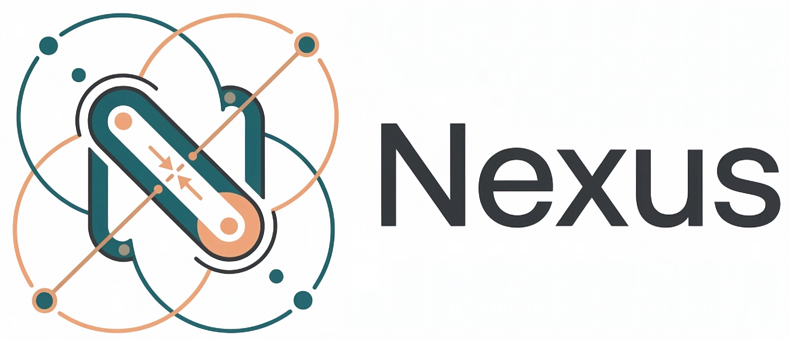

<p align="center">
  
<br/>
<p align="center" style="font-size: xx-large">
        Cross-platform GPU multiphysics simulation
</p>
<p align="center">
    <a href="https://discord.gg/vt9DJSW">
        
    </a>
</p>

**/!\ This library is still under heavy development and is still missing many features.**

The goal of **nexus** is to essentially be "**rapier** on the GPU". It aims to be a cross-platform GPU-accelerated
multiphysics engine, running compute shaders via WebGPU. Shaders are written in Rust using
[Rust-GPU](https://github.com/Rust-GPU/rust-gpu) and compiled to SPIR-V.

## Physics modules

Nexus is organized into three independent physics modules, each available in 2D and 3D:

- **nexus_rbd** - Rigid-body dynamics: colliders (boxes, balls, convex shapes, trimeshes, heightfields), joints (ball, fixed,
  prismatic, revolute), contact resolution.
- **nexus_mpm** - Material Point Method: sand, elastic materials, cutting simulation, cantilever beams.
- **nexus_fem** - Finite Element Method: soft-body simulation with tetrahedral meshes.

## Prerequisites

### Install `cargo gpu`

Nexus uses [`cargo gpu`](https://github.com/Rust-GPU/cargo-gpu) to compile its Rust-GPU shaders to SPIR-V during
the build. **You must install it before building**, otherwise the shader compilation step will fail:

```sh
cargo install cargo-gpu
```

## Running the examples

The example binaries launch a testbed window with all available demos. Use the `--release` flag for good performance,
as debug builds of GPU physics code will be very slow.

```sh
# Run natively
cargo run --release --bin all_examples3
cargo run --release --bin all_examples2
# Run on the browser
cargo run --release --bin all_examples3 --target wasm32-unknown-unknown
cargo run --release --bin all_examples2 --target wasm32-unknown-unknown
```
## License

MIT OR Apache-2.0
